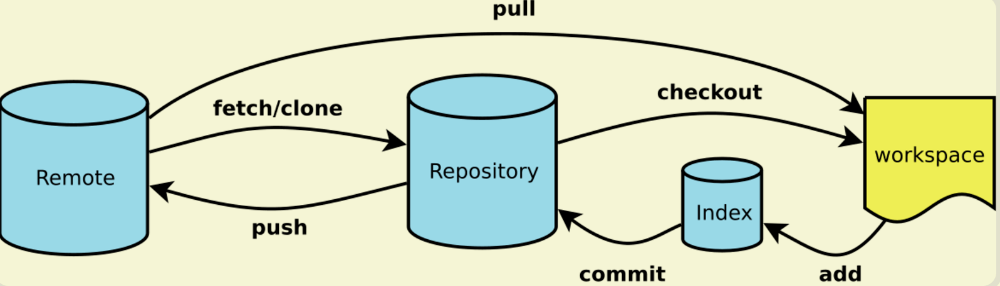
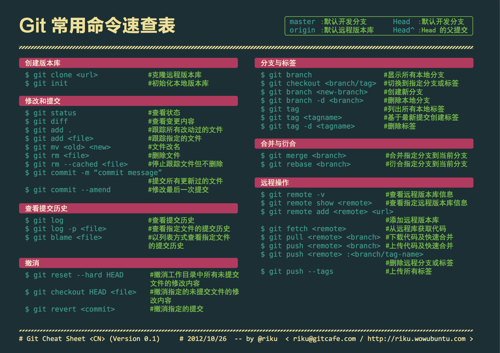

### git常用命令总结

> git这货经常被用，每每出现问题去上网查询时候，总是费时费力。于是乎将其总结成文，以利人利己。

### 简要说明



### 常用命令



### 补充命令

##### 1.本次未提交的代码保到本地缓冲区，代码保存到上次的提交
```shell
git stash
```

##### 2.将本地缓存区的代码取到工作空间
```shell
git stash pop
```

##### 3.显示暂存区和工作区的差异
```shell
git diff
```

##### 4.回滚

- 本地提交之后回滚
	```shell
	git reset --hard [hash]
	```
- 修改之后没有commit到本地代码库
	```shell
	git checkout filename
	```


### 友情链接
> [**常用 Git 命令清单**](http://www.ruanyifeng.com/blog/2015/12/git-cheat-sheet.html)
> 本篇持续更新