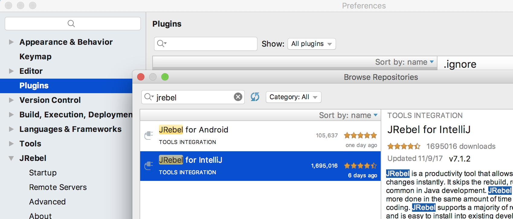
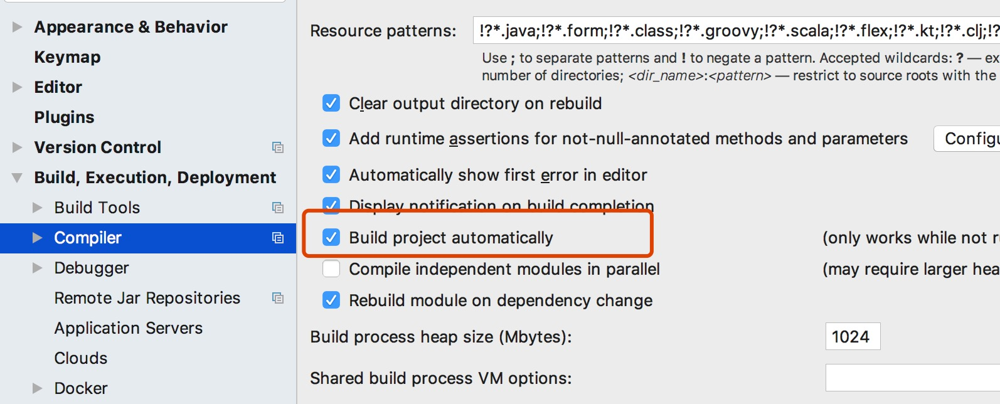
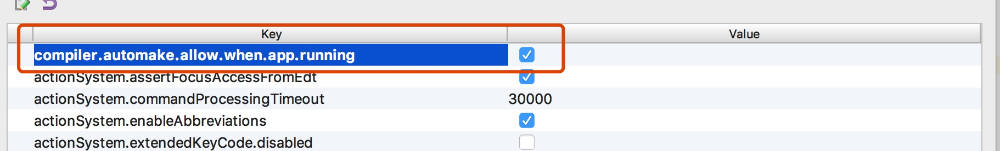
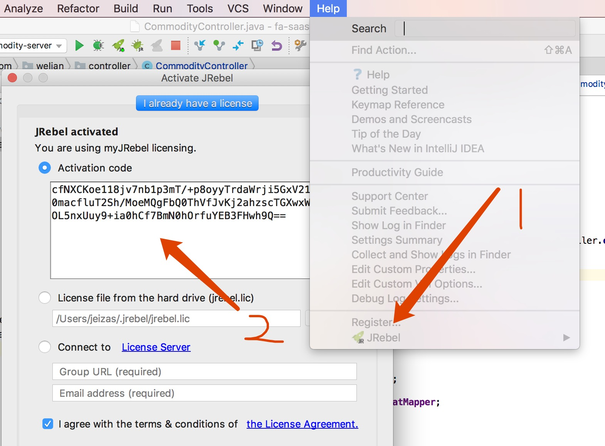
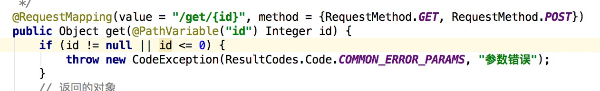
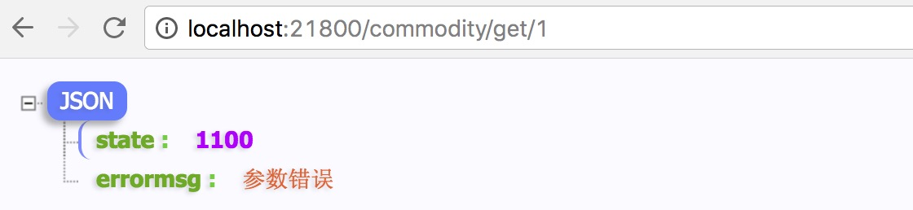
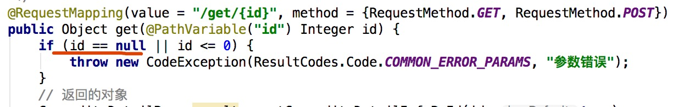

### jreble热部署插件在IDEA中的使用

> 痛点：java开发中，每当修改一个变量或者方法，要想看到修改之后的效果，最有效的方法就是重新启动应用或者跑单元测试，每次启动花费的时间30s~1min不等，多次重复，浪费生命，除非不希望在有限的生命中干更多的事情。这样以来热部署插件就因运而生了。

### 一、安装步骤

- idea 中安装插件

- 配置自动编译

- 勾选上compiler.automake.allow.when.app.running

- 获取激活code，在https://my.jrebel.com/完成注册即可获取

- 激活码贴入idea，完成激活

### 二、启动项目开始测试

- 修改前代码以及输出

- 修改后代码以及输出

- 完成安装，尽情使用吧

### 友情链接

- [**开发者免费激活JRebel地址**](https://my.jrebel.com/)
- [IntelliJ IDEA 2017.2+ JRebel 7.0.12 热部署](http://blog.csdn.net/AscaryBird/article/details/76274245)